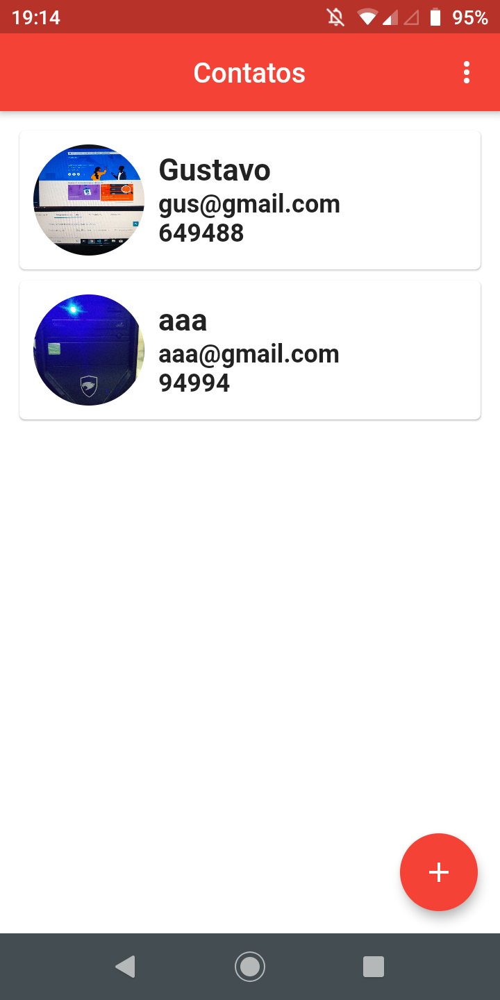
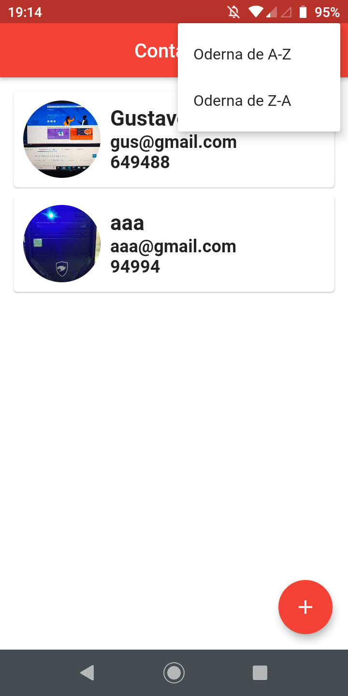
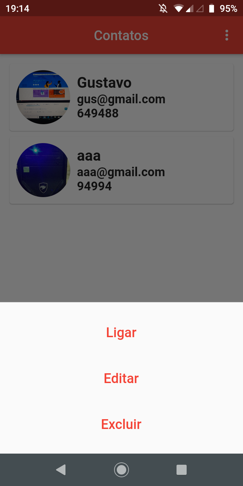
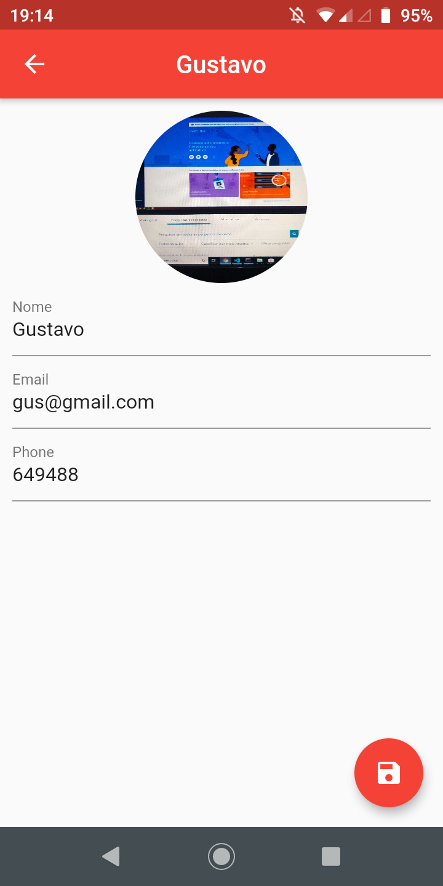

# agenda_contatos

Este foi feito em Flutter.

## Sobre

Ele suas funcionalidade basicas de uma agenda de contatos.

Exemplo:

- Cria contato
- Deleta contato
- Atualizar contato
- Adiciona fotos do contato
- Ordena contato

## Documentação online do Flutter
For help getting started with Flutter, view our
[online documentation](https://flutter.dev/docs), which offers tutorials,
samples, guidance on mobile development, and a full API reference.
